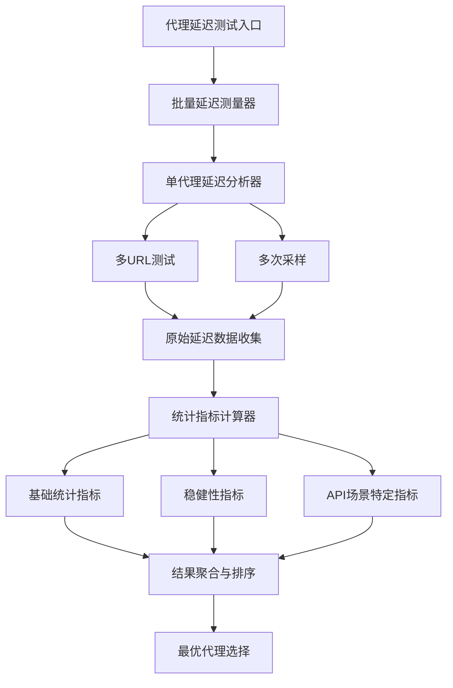
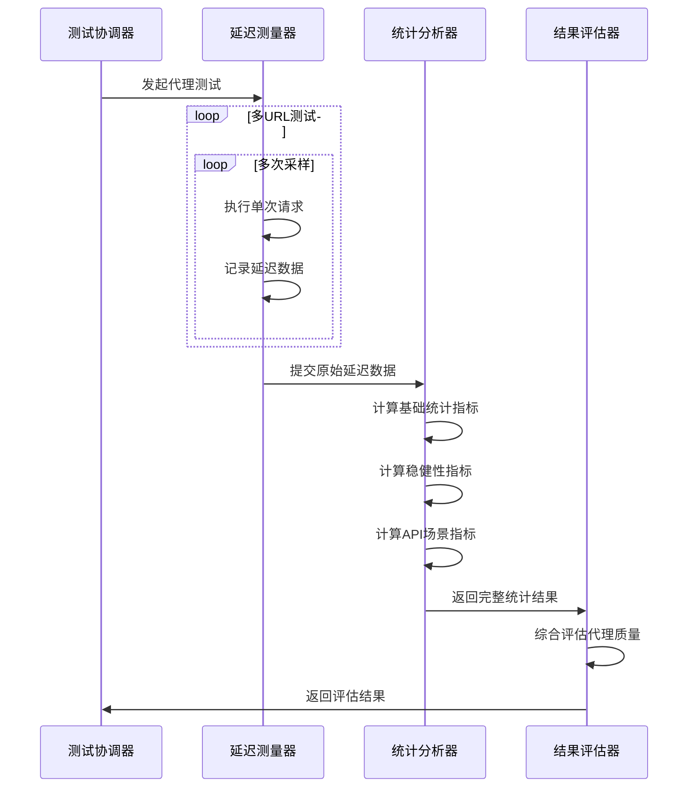
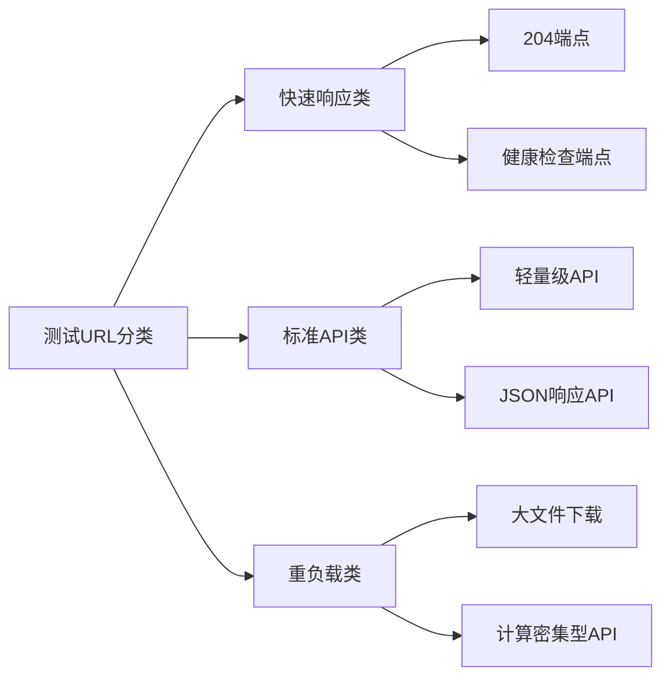
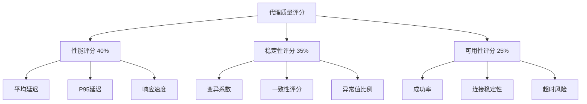
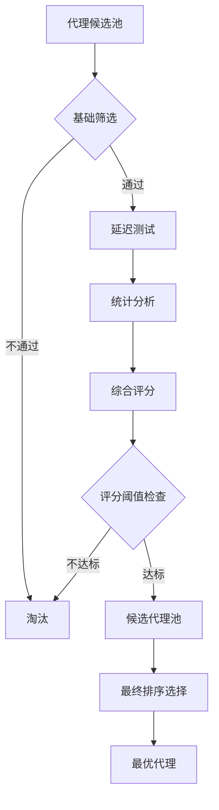
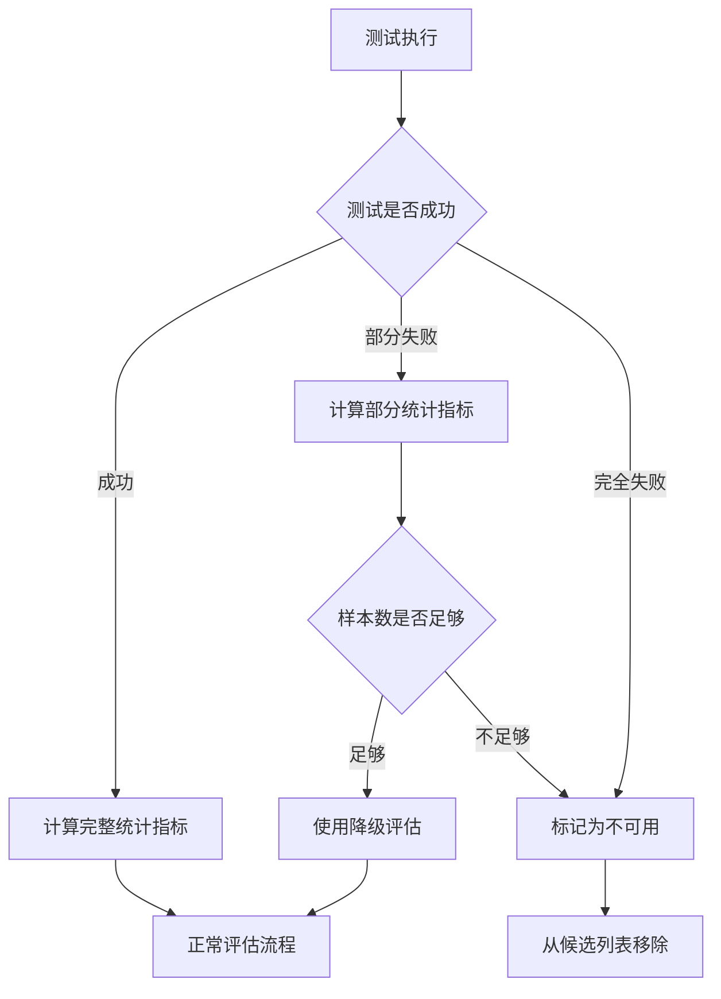
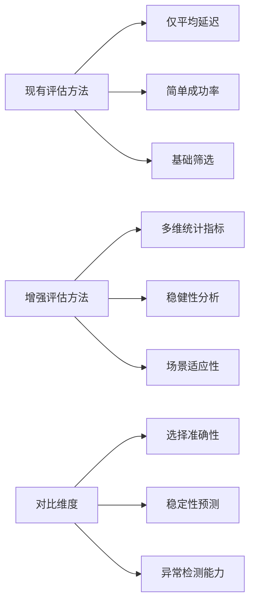
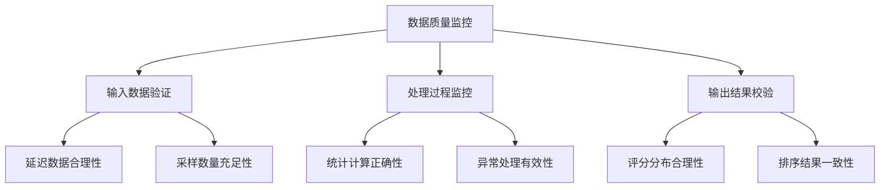

# 代理延迟评估功能增强设计文档

## 概述

针对 New-API 代理更新器项目中的 `measure_proxy_latency` 方法进行功能增强，添加更全面的统计指标和专门针对 API 请求场景的延迟评估方案，以提高代理选择的准确性和可靠性。

## 技术架构

### 延迟评估架构设计



### 延迟评估数据流



## 功能设计

### 增强的统计指标

#### 基础统计指标
- **平均延迟 (Mean Latency)**: 所有成功请求的平均响应时间
- **中位数延迟 (Median Latency)**: 50% 分位数，对异常值不敏感
- **最小/最大延迟 (Min/Max Latency)**: 延迟范围边界
- **四分位数 (Quartiles)**: P25, P50, P75 分位数
- **99分位数 (P99)**: 高延迟边界指标

#### 变异性与稳健性指标
- **标准差 (Standard Deviation)**: 延迟分布的离散程度
- **变异系数 (CV)**: 标准差与均值的比值，衡量相对变异性
- **四分位距 (IQR)**: Q3 - Q1，稳健的离散度量
- **稳健标准差 (Robust SD)**: 基于中位数绝对偏差的稳健标准差
- **一致性评分 (Consistency Score)**: 基于延迟稳定性的综合评分

#### API场景特定指标
- **突发延迟率 (Spike Rate)**: 超过阈值的高延迟请求比例
- **超时风险指数 (Timeout Risk)**: 基于延迟分布的超时概率估算
- **可用性稳定性 (Availability Stability)**: 连续成功请求的稳定性
- **服务质量评分 (QoS Score)**: 综合延迟、稳定性和可用性的评分

### 测试策略设计

#### 多层次测试方案

| 测试层次 | 目标场景 | 测试URLs | 采样策略 |
|---------|---------|----------|----------|
| 连通性测试 | 基础可达性 | 204端点 | 快速单次 |
| 延迟基准测试 | 基础性能 | 多个轻量级端点 | 多次采样 |
| API模拟测试 | 实际负载 | 典型API端点 | 加权采样 |
| 压力测试 | 稳定性验证 | 并发请求 | 持续监控 |

#### 测试URL分类



### 数据结构设计

#### 延迟测试结果结构

```python
{
    "proxy": "ip:port",
    "user": "username",
    "is_working": True,
    
    # 基础统计指标
    "basic_stats": {
        "mean_latency_ms": 150.5,
        "median_latency_ms": 145.0,
        "min_latency_ms": 120.0,
        "max_latency_ms": 250.0,
        "p25_latency_ms": 135.0,
        "p75_latency_ms": 165.0,
        "p95_latency_ms": 220.0,
        "p99_latency_ms": 240.0
    },
    
    # 变异性指标
    "variability_stats": {
        "std_dev_ms": 25.3,
        "coefficient_variation": 0.168,
        "iqr_ms": 30.0,
        "robust_std_dev_ms": 22.1,
        "mad_ms": 18.5  # 中位数绝对偏差
    },
    
    # 稳健性指标
    "robustness_stats": {
        "consistency_score": 0.85,
        "stability_index": 0.78,
        "outlier_ratio": 0.05,
        "trimmed_mean_ms": 148.2  # 去极值平均数
    },
    
    # API场景指标
    "api_performance": {
        "spike_rate": 0.03,
        "timeout_risk_score": 0.12,
        "availability_stability": 0.95,
        "qos_score": 0.82,
        "sustained_performance_score": 0.87
    },
    
    # 测试详情
    "test_metadata": {
        "total_requests": 15,
        "successful_requests": 14,
        "success_rate": 0.933,
        "test_duration_seconds": 45.2,
        "url_results": [...],
        "sampling_strategy": "multi_url_weighted"
    }
}
```

### 评估算法设计

#### 综合评分算法



#### 权重分配策略

| 指标类别 | 权重 | 子指标权重分配 |
|---------|------|---------------|
| 延迟性能 | 40% | 平均延迟(50%) + P95延迟(30%) + 中位数延迟(20%) |
| 稳定性 | 35% | 变异系数(40%) + 一致性评分(35%) + 异常值比例(25%) |
| 可用性 | 25% | 成功率(60%) + 连接稳定性(25%) + 超时风险(15%) |

### 代理选择策略

#### 多维度决策模型



#### 选择决策规则

1. **硬性条件筛选**
   - 基础连通性 > 90%
   - 平均延迟 < 最大可接受延迟
   - 超时风险评分 < 0.2

2. **软性优化指标**
   - 优先选择P95延迟较低的代理
   - 优先选择变异系数较小的代理
   - 优先选择综合QoS评分较高的代理

3. **场景适应性**
   - API密集型场景：重视延迟稳定性
   - 批量处理场景：重视总体吞吐量
   - 实时应用场景：重视低延迟和低抖动

## 实现方案

### 核心功能模块

#### 统计计算模块

```python
class LatencyStatistics:
    """延迟统计计算器"""
    
    @staticmethod
    def calculate_basic_stats(latencies: List[float]) -> Dict
    
    @staticmethod  
    def calculate_variability_stats(latencies: List[float]) -> Dict
    
    @staticmethod
    def calculate_robustness_stats(latencies: List[float]) -> Dict
    
    @staticmethod
    def calculate_api_performance_stats(latencies: List[float], 
                                       success_rate: float) -> Dict
```

#### 评估策略模块

```python
class ProxyEvaluator:
    """代理评估器"""
    
    def __init__(self, weights: Dict[str, float])
    
    def calculate_qos_score(self, stats: Dict) -> float
    
    def calculate_composite_score(self, stats: Dict) -> float
    
    def rank_proxies(self, proxy_results: List[Dict]) -> List[Dict]
```

#### 测试协调模块

```python
class EnhancedLatencyTester:
    """增强的延迟测试器"""
    
    def __init__(self, test_config: TestConfig)
    
    def measure_proxy_latency_enhanced(self, proxy_info: Dict) -> Dict
    
    def batch_test_proxies(self, proxies: List[Tuple]) -> List[Dict]
```

### 配置参数设计

#### 测试配置参数

| 参数名 | 默认值 | 说明 |
|--------|--------|------|
| `LATENCY_TEST_SAMPLES` | 5 | 每个URL的采样次数 |
| `LATENCY_TEST_URLS_COUNT` | 3 | 测试URL的数量 |
| `LATENCY_OUTLIER_THRESHOLD` | 2.0 | 异常值检测阈值(标准差倍数) |
| `LATENCY_SPIKE_THRESHOLD_MS` | 1000 | 突发延迟阈值 |
| `LATENCY_CONSISTENCY_WINDOW` | 0.3 | 一致性评分窗口(变异系数) |

#### 评分权重配置

| 权重参数 | 默认值 | 调整建议 |
|----------|--------|----------|
| `WEIGHT_PERFORMANCE` | 0.4 | API密集型场景可提高到0.5 |
| `WEIGHT_STABILITY` | 0.35 | 稳定性要求高的场景可提高到0.4 |
| `WEIGHT_AVAILABILITY` | 0.25 | 关键业务场景可提高到0.3 |

### 错误处理与降级策略

#### 测试失败处理



#### 降级评估策略

1. **样本不足降级**: 当成功样本 < 3时，仅使用基础指标
2. **单URL降级**: 当多URL测试失败时，使用单一可靠URL
3. **快速评估模式**: 在时间限制下使用简化指标集

## 测试验证

### 性能测试方案

#### 测试用例设计

| 测试场景 | 代理类型 | 预期结果 | 验证指标 |
|---------|---------|----------|----------|
| 高性能代理 | 延迟<100ms，稳定 | 高QoS评分 | 综合评分>0.8 |
| 不稳定代理 | 延迟抖动大 | 低稳定性评分 | 变异系数>0.5 |
| 高延迟代理 | 延迟>1000ms | 低性能评分 | 性能评分<0.3 |
| 间歇性故障代理 | 成功率70% | 低可用性评分 | 可用性评分<0.4 |

#### 基准测试对比



### 回归测试策略

#### 指标一致性验证
- 确保新增指标与现有指标逻辑一致
- 验证统计计算的数学正确性
- 测试边界条件和异常情况

#### 性能影响评估
- 测试延迟评估过程的时间开销
- 验证并发测试的资源消耗
- 确保新功能不影响整体性能

## 监控与优化

### 运行时监控

#### 关键指标监控

| 监控指标 | 监控频率 | 告警阈值 |
|---------|---------|----------|
| 测试成功率 | 每次执行 | <80% |
| 测试执行时间 | 每次执行 | >60秒 |
| 统计计算错误率 | 每次执行 | >5% |
| 选择结果稳定性 | 每日 | 变化>20% |

#### 数据质量监控



### 持续优化策略

#### 算法优化方向
1. **权重自适应调整**: 根据历史表现动态调整评分权重
2. **场景识别优化**: 自动识别使用场景并调整评估策略
3. **预测模型集成**: 基于历史数据预测代理性能趋势

#### 参数调优机制
- 建立参数效果评估机制
- 实现A/B测试框架验证参数调整效果
- 提供参数调优建议和最佳实践
